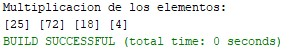

# Java Recursive Array Multiplication

A Java implementation that performs element-wise multiplication between two integer arrays using recursion.

## Description

This project demonstrates the use of recursion to multiply corresponding elements from two integer arrays.

The program receives two arrays of the same size, calculates the multiplication of the values at each corresponding position, and stores the results in a third array.

Instead of using an iterative loop for the multiplication process, the program uses the `multiplicacionValores` recursive method to process one position at a time until all elements have been calculated.

## Features

* Element-wise multiplication of two integer arrays.
* Recursive implementation.
* Result storage in a third array.
* Base case to stop the recursive process.
* Console output of the resulting array.
* Simple implementation focused on recursion fundamentals.

## Technologies

* Java
* Arrays
* Methods
* Recursion
* Console input/output

## How It Works

The program defines two integer arrays:

```java
int[] arr1 = {5, 8, 9, 2};
int[] arr2 = {5, 9, 2, 2};
```

A third array is created to store the multiplication results:

```java
int[] resultado = new int[arr1.length];
```

The recursive method is then called starting at position `0`:

```java
multiplicacionValores(arr1, arr2, resultado, 0);
```

At each recursive call, the corresponding elements are multiplied:

```java
resultado[posicion] = arr1[posicion] * arr2[posicion];
```

The method then calls itself with the next position:

```java
multiplicacionValores(arr1, arr2, resultado, posicion + 1);
```

The recursion stops when the position reaches the length of the array:

```java
if (posicion == arr1.length) {
    return;
}
```

## Recursive Process

For the arrays used in the program:

```text
arr1 = [5, 8, 9, 2]
arr2 = [5, 9, 2, 2]
```

The recursive process performs:

```text
Position 0: 5 × 5 = 25
Position 1: 8 × 9 = 72
Position 2: 9 × 2 = 18
Position 3: 2 × 2 = 4
```

The resulting array is:

```text
[25, 72, 18, 4]
```

## Program Output

The program displays the calculated values in the console:

```text
Multiplicacion de los elementos:
[25] [72] [18] [4]
```



## Project Structure

```text
Java-Recursive-Array-Multiplication/
│
├── src/
│   └── multiplicacionrecursiva/
│       └── MultiplicacionRecursiva.java
│
├── assets/
│   └── images/
│       └── recursive_multiplication_output.jpg
│
├── README.md
├── LICENSE
└── .gitignore
```

## Main Method

The `main` method initializes the input arrays, creates the result array, calls the recursive multiplication method, and displays the resulting values.

## Recursive Method

The `multiplicacionValores` method receives:

* `arr1`: First input array.
* `arr2`: Second input array.
* `resultado`: Array used to store the results.
* `posicion`: Current position being processed.

The method uses a base case to terminate the recursion and recursively processes the remaining positions.

## Concepts Demonstrated

This project demonstrates:

* Recursion.
* Base cases.
* Recursive calls.
* Array indexing.
* Array traversal.
* Method parameters.
* Result storage.
* Element-wise operations.

## Complexity

For two arrays containing `n` elements, the recursive method processes each position exactly once.

Time complexity:

```text
O(n)
```

The recursion creates one stack frame per processed element, resulting in:

```text
O(n)
```

auxiliary space due to the recursive call stack.

## Execution

Compile and run the `MultiplicacionRecursiva.java` file using a Java development environment or command line.

The program does not require external libraries or additional dependencies.

## Limitations

The current implementation assumes that:

* Both input arrays have the same length.
* The result array has sufficient capacity.
* The arrays contain integer values.

No additional validation for different array lengths is implemented in the original program.

## License

This project is distributed under the MIT License.

See the `LICENSE` file for more information.

## Author

**Luis Alva**

Java project focused on recursion and fundamental data processing techniques.
